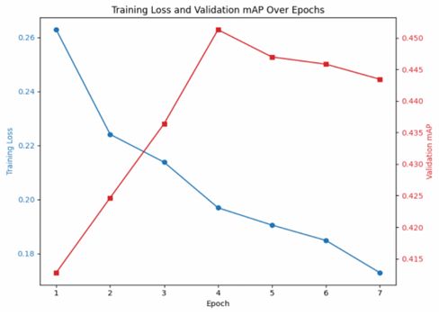

# NYCU Computer Vision 2025 Spring HW2

## Student Information
**Student ID**: 111550150
**Name**: 俞祺譯

## Introduction
This repository implements a digit detection and recognition pipeline using Faster R-CNN with a ResNet50-FPN v2 backbone. The model is trained to detect and classify digits in images, then reconstruct full numbers by aggregating predictions.

## Features
- Faster R-CNN with ResNet50-FPN v2 backbone for object detection
- Custom dataset loader for COCO-style digit annotations
- Tracks training loss, validation mAP, and learning rate schedules
- Automatic generation of detection results in JSON and CSV

## How to Install
### Prerequisites
Ensure the following are installed:
- Python 3.8+
- PyTorch (with GPU support)
- COCO API
- OpenCV, Matplotlib, TQDM

### Installation Steps
```bash
# Clone the repository
git clone https://github.com/ianthefish/Visual-Recognition-FasterRCNN.git
cd Visual-Recognition-FasterRCNN

# Install dependencies
pip install -r requirements.txt

# Run the code
python model.py
```

## Dataset Setup
Prepare the dataset in the following directory structure:
```
nycu-hw2-data/
├── train/
├── valid/
├── test/
├── train.json
└── valid.json
```
- train.json and valid.json follow the COCO annotation format.

- test/ should contain .png images named by their image IDs.

## Performance Snapshot



The final Highest Val mAP is **0.4515**.
The final Validation Acc is **0.8623**.